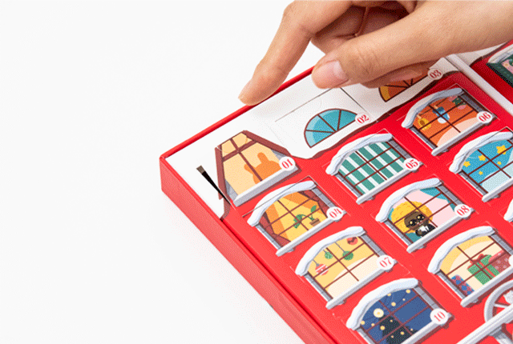
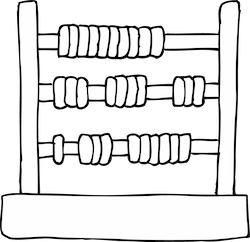
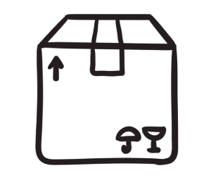
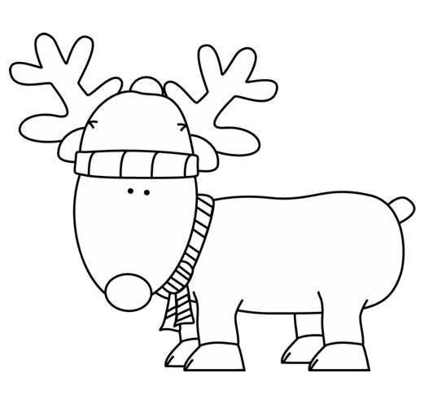

   

# AdventJS

In this repository of git I collect the solved challenges, that come from the website:
[https://adventjs.dev/](https://adventjs.dev/)

## 25 days of JavaScript challenges

### What is an Advent?

Although it has its roots in the Catholic religion, Advent has become a tradition where children get chocolate for 4 weeks, one per day, from December 1st to 24th.

### Every day a new challenge!

Starting on December 1st and until December 25th, every day, a new challenge for you to solve with JavaScript. Compete with your friends!

## Challenges

| # | Name | Description |       |
|---|------|-------------|-------|
| <ul><li>- [x] #01</li></ul> | [Counting sheep to sleep](./challenge-01/README.md) | With the excitement of Christmas coming, we're having a hard time sleeping quite a bit lately. Let's try using this little trick that will help us fall asleep faster 🐑. |  |
| <ul><li>- [x] #02</li></ul> | [Help the elf to list the gifts!](./challenge-02/README.md) | What a mess 😵! An elf is helping Santa Claus. He thought it would come to him already ordered from each gift how many units he should get.... and he got a letter ✉️ Help him out! |  |
| <ul><li>- [x] #03</li></ul> | [The Grinch wants to ruin Christmas](./challenge-03/README.md) | The Grinch is on the loose and wants to screw up Christmas! 😱 Let's fix the mess he's made in Santa's gift factory. |  |
| <ul><li>- [x] #04</li></ul> | [It's time to put Christmas in the house!](./challenge-04/README.md) | I think we can bring out the Christmas bonnets, the nougat... And the Christmas tree! 🎄 Let's set it up with JavaScript. |  |
| <ul><li>- [x] #05</li></ul> | [Counting down the days to presents](./challenge-05/README.md) | I can't wait to open the presents 🎁! I'm so nervous that I can't stop counting the days to go 🤣 Can you help me by creating a schedule? Come on! |  |
| <ul><li>- [x] #06</li></ul> | [Finishing off final exams](./challenge-06/README.md) | Buffff! I can smell the holidays already but I still have to finish my final exams, and it's time for some maths! 😱 Help me! |  |
| <ul><li>- [x] #07</li></ul> | [Searching the store...](./challenge-07/README.md) | We have a friend who works in a shop and he is not able to find the products he has in stock... Can we help him? |  |
| <ul><li>- [ ] #08</li></ul> | [The cryptocurrency craze](./challenge-08/README.md) | We have invested in cryptocurrencies... And the other day all the stocks went into the red. Instead of panicking, let's see if we can optimize new investments. |  |
| <ul><li>- [ ] #09</li></ul> | [Automatically grouping things together](./challenge-09/README.md) | We have a lot of boxes in the gift factory... and if we don't automate somehow to sort this mess.... We might run out of Christmas! |  |
| <ul><li>- [ ] #10</li></ul> | [The change machine](./challenge-10/README.md) | For the Christmas sales, we're going to automate the change of coins so that it doesn't have to be done manually. We'll save time! But first, we have to program it. |  |
| <ul><li>- [ ] #11</li></ul> | [Is the cinema loyalty card worth it?](./challenge-11/README.md) | There's a bunch of blockbusters at the movies this month! Seeing as I'm going to have to go through the box office quite a bit in 2022 as well, I'm looking to optimize my spending. Help me out! |  |
| <ul><li>- [ ] #12</li></ul> | [The perfect route to drop off gifts](./challenge-12/README.md) | In Santa's workshop they are already preparing everything to be able to make the perfect route to leave the presents. The problem is that there are some obstacles in the way that we must avoid... |  |
| <ul><li>- [ ] #13</li></ul> | [Wrap gifts with asterisks](./challenge-13/README.md) | We're on fire wrapping presents.... but we need to automate this before the elves decide to go on strike! Save Christmas (again)! |  |
| <ul><li>- [ ] #14</li></ul> | [In search of the lost reindeer](./challenge-14/README.md) | In Santa's village they have gone for a walk with the reindeer and one of them has escaped, oh my! Now to look for it. 😿 |  |
| <ul><li>- [ ] #15</li></ul> | [The perfect jump](./challenge-15/README.md) | We are optimizing the sled so that the jumps it makes are as optimal as possible. A friend of mine who has a Tesla has explained the best way, so let's see if we can't come up with a function to make sure! |  |
| <ul><li>- [ ] #16</li></ul> | [Deciphering the numbers...](./challenge-16/README.md) | We have found some mysterious letters that contain a lot of symbols. Luckily we have the dictionary to decode them. Let's see what they contain! |  |
| <ul><li>- [ ] #17</li></ul> | [The madness of sending packages in this time of the year](./challenge-17/README.md) | The Christmas season is coming and the shipping companies are calculating the number of packages they will be able to send. Let's see how we do it! |  |
| <ul><li>- [ ] #18</li></ul> | [Santa's operating system](./challenge-18/README.md) | We are programming an operating system for the computers in Santa's workshop... We have to manage the file names so that they don't repeat themselves. |  |
| <ul><li>- [ ] #19</li></ul> | [What should we learn at Platzi?](./challenge-19/README.md) | There are a lot of courses on Platzi! We want to do two courses and our time is limited, let's create a function to choose the best two courses to do according to our time! |  |
| <ul><li>- [ ] #20</li></ul> | [A pangram chart? WHAT!](./challenge-20/README.md) | The children of Lapland have in their Spanish class the challenge to create a letter to Santa Claus with all the letters of the alphabet...Help us to detect if they get it right! |  |
| <ul><li>- [ ] #21</li></ul> | [The route with gifts](./challenge-21/README.md) | People think that Santa's bag is bottomless but the reality is that it is the elves who are in charge of making his travels fit to carry and collect all the presents all over the world. |  |
| <ul><li>- [ ] #22</li></ul> | [How many ornaments does the tree need?](./challenge-22/README.md) | Alas, Christmas is coming and we haven't decorated the tree yet. 🎄😱 We have to do something as soon as possible! |  |
| <ul><li>- [ ] #23</li></ul> | [Can you reconfigure the factories so we can't stop creating gifts?](./challenge-23/README.md) | Santa wants the machines running 24 hours a day, like this is a Pocholo rave. Chiki pun chiki pun. Help him get it! |  |
| <ul><li>- [ ] #24</li></ul> | [Comparing Christmas trees](./challenge-24/README.md) | Grandpa and Grandma have been arguing all day about whether Christmas trees are all the same... Let's get it out of the way! |  |
| <ul><li>- [ ] #25</li></ul> | [The last game and until next year 👋](./challenge-25/README.md) | A mouse has seen that there's a lot of food left in the dining room 🥮 and is already licking his whiskers for the feast he's going to feast on. 🐭 |  |

## References

[Retos de programación en diciembre: Advientos de Código](https://midu.dev/retos-programacion-advent-of-code/)

- [Advent of code (2015-2022)](https://adventofcode.com/)
Soluciones:
  - [ngxCoder Andrés Tuñón (2021)](https://ngxcoder.dev/tag/challenge/)
  - [Cristiana's Dev Blog (2021)](https://blog.cristiana.tech/series/advent-of-code-2021)
- [Advent of CSS (2021)](https://www.adventofcss.com/)
- [Advent of Javascript (2021)](https://www.adventofjs.com/)
- [AdventJS (2021)](https://adventjs.dev/)  
	Soluciones:
	- [Blog Pedro López Mareque](https://www.pmareke.com/posts/advent-js-2021-1-5/)
	- [Youtube Runcoding](https://www.youtube.com/watch?v=ZdU6c8sYJ7A&list=PL9U8K1aoRM6zMtHh1lrso5Oq5EfIEAxR8)
	- [GitHub Borja Paz Rodríguez](https://github.com/borjapazr/awesome-adventjs)
